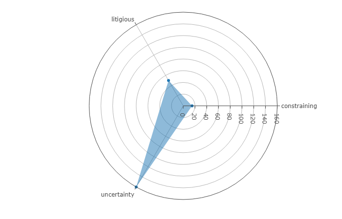
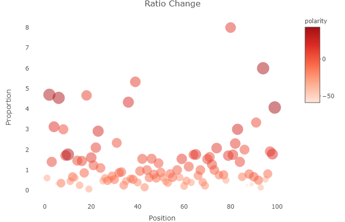

```{r setup, include=FALSE}
knitr::opts_chunk$set(echo = TRUE, fig.align = "center")
```

* Be sure to have the  following libraries installed before processing further.

```{r librarys, message=FALSE, warning=FALSE}
library(dplyr)
library(ggplot2)
library(stringr)
library(tm)
library(SnowballC)
library(tidyr)
library(tidytext)
library(wordcloud)
library(plotly)
library(RColorBrewer)
library(textdata)
library(colortools)
library(magrittr)
```

## Sentiment in Music

Music people listen to can be a great source of exciting information. It can open the door to understanding why particular songs are very popular while others do not get enough attention. It can help understand where the trend is going and how music has evolved during the years. The key to making such observations substantially lies in the lyrics of the songs, the richest source of information about the song. Through lyrics, one can observe the mood prevailing in the song and what words contribute to creating that mood. 
To analyze songs, we scrapped lyrics of the all-time top viewed songs from [Genius](https://genius.com/).The tool we used to scrap the lyrics uses Python Selenium to interact with the website and get the desired data.
[(Scrapping Tool)](https://github.com/Ea0011/lyrics_scrapper).  

## The Data

The data we are going to work with consists of 100 most viewed songs on Genius.
```{r include=FALSE}
geniusLyrics <- read.csv("lyrics_with_dates.csv", stringsAsFactors = F)
```
```{r}
str(geniusLyrics)
```
Our data frame has the following information about each song. *Author*, *Title*, *Lyrics*, *Release Date*, *Album* and *Views*. We can already notice that there are problems with the data. Types of variables in the data are wrong. Moreover, lyrics of songs contain a lot of text-related problems.
```{r echo=FALSE}
substr(geniusLyrics[2, ]$Lyrics, 1, 500)
```
We can see that there are a lot of symbols that will hinder analysis. Also, text is full of white space, line breaks and annotations which are not part of lyrics. So, we will need to per-process the data before preforming actual analysis. Libraries ```dplyr``` and ```stringr``` are perfect to manipulate the data and get rid of existing problems.
```{r}
geniusLyrics <- geniusLyrics %>%
  mutate(Views = as.numeric(str_remove_all(Views, pattern = 'M'))) %>%
  mutate(Release.Date = as.Date(Release.Date, format = '%B %d, %Y')) %>%
  mutate(Lyrics = str_remove_all(string = Lyrics, pattern = '\\s*\\([^\\)]+\\)')) %>%
  mutate(Lyrics = str_remove_all(string = Lyrics, pattern = '\\s*\\[[^\\]]+\\]')) %>%
  mutate(Lyrics = iconv(Lyrics, to = 'ASCII', sub = '')) %>%
  mutate(Lyrics = trimws(Lyrics)) %>%
  filter(Title != 'Despacito (Remix)') %>%
  mutate(Year = format(Release.Date, '%Y')) %>%
  mutate(Position = row_number())
```
First, we transform variables to their appropriate types. Using regexp, we remove annotations from lyrics, remove any non ASCII characters and get rid of unnecessary whit space. Also, we remove a particular song because it mainly in Spanish which hinders sentiment analysis. We add new variables to the dataset. ``Year`` is for observing differences that between songs released in particular year. Since our scrapping tool scrapped the table from top to bottom we also can add variable ``Position`` which describes the place in the all-time top chart of each song.  

## Text Analysis
In order to visualize the most frequently used and the most important words weighted using tf-idf will wil use comparison clouds. As the amount of the observations is very large for creating a meaningful comparison cloud, we will filter the lyrics by picking the most popular songs based on their views for each unique year. As a result of filtering we get only 12 observations as there are only 12 unique years.
```{r warning=FALSE, message=FALSE}
lyricsByYears <- geniusLyrics %>%
  group_by(Year) %>%
  filter(Position == min(Position))%>%
  as.data.frame()

colors <- c("#4BB446","#46B478","#46B4AF",
            "#4682B4","#464BB4","#7846B4",
            "#AF46B4","#B44682" ,"#B4464B",
            "#B47846","#B4AF46","#82B446")

str(lyricsByYears)
```

We create two comparison clouds. For the first one we control the TermDocumentMatrix using the term frequency, in order to visualize the most frequently used words in the filtered lyrics
```{r warning=FALSE, message=FALSE}
compareAndCloud <- function(lyrics,colNames,cols,option=weightTf,setThresold=F){
  vs <- VectorSource(lyrics)
  cp <- VCorpus(vs)
  tdm <- TermDocumentMatrix(cp, control = list(
    removePunctuation = T,
    stopwords = T,
    removeNumbers = T,
    weighting = option
  ))
  if(setThresold){
    tdm <- removeSparseTerms(tdm,0.99) 
  }
  lyricMatrix <- as.matrix(tdm)
  colnames(lyricMatrix) <- colNames
  set.seed(2)
  comparison.cloud(lyricMatrix, 
                   max.words = 100,
                   colors= cols,
                   min.freq = 10,
                   scale=c(1,0.5),
                   title.size=1,
                   title.colors = cols)
}

createComparisonCloud <- function(filtered,option=weightTf,setThresold=F){
  compareAndCloud(lyrics = filtered$Lyrics,colNames = filtered$Year, cols = colors,
                  option = option, setThresold = setThresold)
}

createComparisonCloud(lyricsByYears)

```


For the second comparison cloud we control the weighting of the words using tf-idf in order to find out the most important words used in the filtered songs. There are many words which appear in both comparison clouds which means most of the frequent words in these songs are also very important.
```{r warning=FALSE, message=FALSE}
createComparisonCloud(lyricsByYears,weightTfIdf,T)
```

Visualizing the most frequent words in the filtered songs using a bar plot
```{r warning=FALSE, message=FALSE}

visualizeTopNWords <- function(filtered,topNum){
  vs <- VectorSource(filtered$Lyrics)
  cp <- VCorpus(vs)
  
  tdm <- TermDocumentMatrix(cp, control = list(
    removePunctuation = T,
    stopwords = T,
    removeNumbers = T
  ))
  lyricsMatrix <- as.matrix(tdm)
  
  df_freq <- data.frame(terms=rownames(lyricsMatrix), 
                        freq=rowSums(lyricsMatrix), 
                        stringsAsFactors = F)
  
  
  top_num <- df_freq %>% 
    top_n(topNum, freq) %>%
    arrange(desc(freq))
  
  top_num %>%
    ggplot(aes(x=reorder(terms,freq),y = freq, fill=terms))+
    geom_bar(stat="identity")+
    labs(x="Words", y="Number of occurences",
         title="The most popular words in the most popular songs for filtered Years")+
     theme(legend.position = "none")
}

visualizeTopNWords(lyricsByYears,10)
```

Let's compare the most frequent words of the newest and oldest songs in our filtered lyrics.
As it is visible from the comparison cloud, the oldest song's lyrics has higher variety of words which are used very frequently in the lyrics, whereas there are only a few words in the newest song's lyrics that appear frequently in the song.
```{r warning=FALSE, message=FALSE}
compareOldestNewest <- function(filtered){
  oldestLyrics <- filtered %>% 
    filter(Year == min(Year))
  
  newestLyrics <- filtered %>%
    filter(Year == max(Year))

  lyricsForBoth <- c(oldestLyrics$Lyrics, newestLyrics$Lyrics)
  colnames <- c(oldestLyrics$Year, newestLyrics$Year)
  colors <- c('red','blue')
  compareAndCloud(lyricsForBoth,colNames = colnames,cols = colors)
}

compareOldestNewest(lyricsByYears)

```


Now let's analyze the appearance of common words in the filtered songs.
The barplot shows that the highest number of common words are shared between the most popular songs of 2012 and 2013, and the least common words are in the popular songs of 2014 and 2015. The number of common words is generated after removing punctuation, numbers and stopwords from the lyrics.
```{r}
commonWordsCount <- function(lyrics){
  vs <- VectorSource(lyrics)
  cp <- VCorpus(vs)
  tdm <- TermDocumentMatrix(cp, control = list(
    removePunctuation = T,
    stopwords = T,
    removeNumbers = T
  ))
  commonMatrix <- as.matrix(tdm)
  colnames(commonMatrix) <- c("first","second")
  rownames(tdm)
  commonWords <- data.frame(terms = rownames(commonMatrix),commonMatrix) %>% 
    filter(first > 0 & second > 0)
  return(nrow(commonWords))
}

compareCommons <- function(filtered){
  i <- 1
  commonCounts <- c()
  filtered <- filtered %>%
  arrange(desc(Year))
  ranges <- c()
  
  while(i < nrow(filtered)){
    first <- filtered[i,]
    second <- filtered[i+1,]
    combined <- c(first$Lyrics,second$Lyrics)
    commonCounts <- c(commonCounts, commonWordsCount(combined))
    ranges <- c(ranges,paste(second$Year,first$Year, sep = "&"))
    i = i + 2
  }
  
  commonDf <- data.frame(ranges, commonCounts)
  colnames(commonDf) <- c("Mutual","Count")
  commonDf$Mutual <- as.factor(commonDf$Mutual)
  return(commonDf)
}


compareCommons(lyricsByYears) %>%
  ggplot(aes(x = reorder(Mutual,Count), y = Count, fill = Mutual))+
  geom_bar(stat = "identity", fill = colors[1:6])+
    labs(x="The years of the songs", y="The number of common words",
         title="The distribution of common words in each range of succeding unique years")+
     theme(legend.position = "none")+
      coord_flip()
```

Now let's do a little analysis of the filtered song's lyrics by seperating each word in the songs
```{r}
seperatedWords <- lyricsByYears %>%
  unnest_tokens(word, Lyrics)

wordsGroups <- seperatedWords %>%
  group_by(Year,word) %>%
  summarise(count = n())

```

The number of common words in the newest and oldest song is 46, whereas the usage of the same word between the newest popular song and the one from the previous year appears 40 times. 
```{r}

oldLyrics  <- wordsGroups %>% filter(Year == "1975")
newLyrics  <- wordsGroups %>% filter(Year == "2019")

commonWords <- oldLyrics %>%
  inner_join(newLyrics, by = "word")

dim(commonWords)


pastYearLyrics <- wordsGroups %>% filter(Year == "2018")

currentCommonWords <- pastYearLyrics %>%
  inner_join(newLyrics, by = "word")

dim(currentCommonWords)

```

## Sentiment Analysis


Sentiment analysis is meant to get an overall impression of the emotions, mood and sentiment from the song. It involves assigning a label to each word in the lyrics and those labels can differ in their nature. For instance, one can assign a weight or a score to each word which tells how good or bad each word is to some degree. Words can be labelled just negative or positive without giving them weight or they can be labelled according to the emotions they emit. Having such labels assigned to each song enables us to extract sentiment from the song. However, there are several approaches to this. After assigning labels, one can analyze sentiment in so-called intervals. For example, we can analyze sentiment per sentence, per paragraph or the whole song. But since songs in the list are very short compared to the text found in books, or speech reports it is not viable to assess sentiment level per song or per sentence. Rather, we can analyze sentiment per word and this gives several advantages and can yield substantial insights about sentiment in songs. We can observe how sentiment changes during the song or which emotions prevail in each song.
Library ``tidy text`` has a method that provides a dataset of words already labelled for sentiment analysis. 3 options come with the library.  

1. Words labeled as positive or negative
```{r}
head(get_sentiments("bing"), n = 5)
```
2. Words labeled with a degree of positivity or negativity
```{r}
head(get_sentiments("afinn"), n = 5)
```
3. Words labeled as an emotion they elicit.
```{r}
tail(get_sentiments("loughran"), n = 5)
```

To proceed with sentiment analysis, we need to extract words from the lyrics in our dataset and match them to the words in sentiments dataset in order to get appropriate labels for our words. Tokenizing lyrics will greatly transform our dataset. Instead of having one data frame in a wide format that represents each song, we are going to have a data frame in a long format that shows to which particular song a word belongs to.
```{r}
tokenizedLyrics <- geniusLyrics %>%
  unnest_tokens(word, Lyrics)

str(tokenizedLyrics)
```
```{r}
dim(tokenizedLyrics)
```
```{r}
head(tokenizedLyrics, n = 5)
```

Instead of 99 rows, in our new data we have ``59252`` rows as expected.
Before labeling words in our new data, we should remove common words found almost in every text which are called stopwords. Common examples of stopwords are **the**, **a**. Such words do not give meaningful value to the sentiment of the song so they can be removed. Stopwords can be retrieved using ``stopwords('language')``
```{r}
stopwordsDf <- data.frame(word = stopwords('en'), stringsAsFactors = F)

tokenizedLyrics <- tokenizedLyrics %>%
  anti_join(stopwordsDf, by = "word")

dim(tokenizedLyrics)
```
Notice that the number of words in the data got almost halved, there were a lot of stopwords used in lyrics.
Format of our data makes it easy to obtain sentiment scores for words. It is simply a matter of performing a join with already labelled words, similar to what we did to remove stopwords.
```{r}
bingSentiments <- tokenizedLyrics %>%
  inner_join(get_sentiments("bing"), by = "word")

dim(bingSentiments)
```

```{r}
afinnSentiments <- tokenizedLyrics %>%
  inner_join(get_sentiments("afinn"), by = "word")

dim(afinnSentiments)
```

```{r}
loughranSentiments <- tokenizedLyrics %>%
  inner_join(get_sentiments("loughran"), by = "word")

dim(loughranSentiments)
```

Structure of our data frame is not much different from what it was. The number of observations got lower and one more column got added to our data. In the case of ``bing`` and ``loughran`` sentiment scores, we have a column ``sentiment`` representing the label, in case of ``afinn`` score, we get a column named ``value`` which represents sentiment weight for each word.

## Performing Sentiment Analysis


Now, as we have sentiment scores per word, we can start looking at what our data can tell us about all-time top charted songs. First, lets see how many words there are per year in our data.

```{r}
bingSentiments %>%
  group_by(Year) %>%
  summarise(Number.Of.Words = n()) %>%
  arrange(desc(Number.Of.Words))
```

There are years which have low number of words. This can be a hindrance in understanding how sentiments changed over time, but understanding the change in proportion of negative and positive words during time is possible. Also, we can observe polarity, the difference between number of positive and negative words.

```{r}
changeOverTime <- bingSentiments %>%
  group_by(Year) %>%
  summarise(negatives = sum(sentiment == "negative"), positives = sum(sentiment == "positive")) %>%
  mutate(proportion =  positives / negatives) %>%
  mutate(polarity = positives - negatives)

tail(changeOverTime, n = 5)
```

```{r}
themeObject <- function() {
  return (theme(
    plot.subtitle = element_text(color="#666666"),
    axis.text.x = element_text(size = 10),
    axis.text.y = element_text(size = 12)
  ))
}
```

```{r}
changeOverTime %>%
  ggplot(aes(x = Year, y = proportion, fill = proportion)) + 
  geom_bar(stat = "identity") + 
  coord_polar(theta = "x") + 
  aes(x = reorder(Year, proportion)) +
  geom_hline(aes(yintercept = 1), color = "red") +
  scale_fill_gradientn(
    colours = brewer.pal(3, "Reds"),
    guide = guide_colorbar(title = "Positives / Negatives")
  ) + 
  themeObject() +
  theme_light() + 
  theme(
    axis.title.y = element_blank(),
    axis.ticks.y = element_blank(),
    axis.text.y = element_blank()
  ) +
  labs(
    x = "Year",
    y = "",
    title = "Ratio of Positive Words to Negative Words",
    subtitle = "Change of Ratio Over Time"
  )
```

The year with most positive to negative ratio is 2019. Moreover, number of positive words is almost twice the number of negative words. Compared to other years, 2019 boasts with good sentiment. The least positive year is 2010. Negative sentiment greatly prevailed in 2010. It becomes clear that more negative sentiment is expressed in general, as most of the time the ratio is either less than 1 or little more than 1. We can also observe how the polarity changes in the same manner.

```{r message=FALSE, warning=FALSE}
changeOverTime %>%
  ggplot(aes(x = Year, y = polarity, fill = polarity)) +
  geom_bar(stat = "identity") +
  scale_fill_gradient(low = "blue", high = "red", guide = guide_colorbar(title = "Polarity")) +
  themeObject() +
  labs(
    x = "Year",
    y = "Polarity",
    title = "Polarity",
    subtitle = "Change of Polarity Over Time"
  ) +
  ylim(-120, 120)
```

After observing polarity, the prevalence of negative sentiment becomes even more visible.  

Using ``loughran`` sentiment set we can observe what kind of emotions are mostly expressed in songs. Radar plot is great for visualizing this. We must first filter out positive and negative labels to get clear image of other emotions.

```{r}
emotions <- loughranSentiments %>%
  filter(sentiment != "positive" & sentiment != "negative")
```

Lets get overall picture for all songs.

```{r message=FALSE, warning=FALSE}
overallEmotions <- emotions %>%
  group_by(sentiment) %>%
  summarise(count = n())

plot_ly(
  type = 'scatterpolar',
  fill = 'toself',
  r = overallEmotions$count,
  theta = overallEmotions$sentiment,
  name = 'Emotions In Songs'
) %>%
  layout(
    polar = list(
      radialaxis = list(
        visible = T,
        range = c(0, max(overallEmotions$count))
      )
    ),
    showlegend = F
  )
```



Songs mostly reflect uncertainty, litigiousness and being under constraint. At some point, songs reflect the uncertainty of what the situation is or how something is going to end up. Maybe the artist wants to reflect uncertainty of his/her own situation in the song. Litigiousness is concerned with taking legal actions to resolve something and constraints are about hindrances that prevent success or achieving of something desirable. Lets see words that contribute to such amount of uncertainty.

```{r}
prevailingEmotions <- loughranSentiments %>%
  filter(sentiment %in% c("uncertainty", "litigious", "constraining")) %>% 
  group_by(word, sentiment) %>%
  summarise(count = n()) %>%
  arrange(desc(count))

uncertain <- prevailingEmotions %>%
  filter(sentiment == "uncertainty")

wordcloud(
  words = uncertain$word,
  freq = uncertain$count,
  random.color = T,
  colors = brewer.pal(5, "Dark2"),
  min.freq = 1,
  random.order = F
)
```
*Maybe*, *Might* and *Believe* are causing uncertainty to appear in songs. Songs portray a situation in which the outcome is undecided, something or someone is under doubt.

```{r}
litigious <- prevailingEmotions %>%
  filter(sentiment == "litigious")

wordcloud(
  words = litigious$word,
  freq = litigious$count,
  random.color = T,
  colors = brewer.pal(5, "Dark2"),
  min.freq = 1,
  random.order = F
)
```
Litigiousness is expressed through terms related to law and court.

```{r}
constraint <- prevailingEmotions %>%
  filter(sentiment == "constraining")

wordcloud(
  words = constraint$word,
  freq = constraint$count,
  random.color = T,
  colors = brewer.pal(5, "Dark2"),
  min.freq = 1,
  random.order = F
)
```
Constraints in songs are expressed through being under a limit or being commuted to a certain thing.

```{r message=FALSE, warning=FALSE}
changeOverRanking <- bingSentiments %>%
  group_by(Position) %>%
  summarise(negatives = sum(sentiment == "negative"), positives = sum(sentiment == "positive"), Title = Title[1]) %>%
  mutate(proportion =  positives / negatives) %>%
  mutate(polarity = positives - negatives)

plot_ly(
  changeOverRanking,
  x = ~Position,
  y = ~proportion,
  text = ~Title,
  type = "scatter",
  mode = "markers",
  color = ~polarity,
  colors = brewer.pal(5, "Reds"),
  sizes = c(5, 300),
  size = ~polarity,
  marker = list(opacity = 0.5)
) %>%
  layout(
    title = "Ratio Change",
    xaxis = list(showgrid = FALSE, zeroline = FALSE),
    yaxis = list(showgrid = FALSE, zeroline = FALSE, title = "Proportion")
  )
```



Middle portion of the table contains songs with similar positive to negative ratio. However, when we get to the top or to the bottom of the table, ratio gets higher meaning that songs expose more positive emotions. 

## Analysing Sentiment Per Song

Songs are not homogeneous when it comes to emotions that they expose. Moreover, emotions can change when the song progresses. The beginning can be all positive but towards the end, a song can expose sadder emotions. Weighted sentiments are perfect to understand such change. First, lets get artists that have most songs in the chart.

```{r}
geniusLyrics %>%
  group_by(Author) %>%
  summarise(count = n()) %>%
  arrange(desc(count)) %>%
  top_n(3, count) %>%
  ggplot(aes(x = Author, y = count, fill = Author)) +
  geom_bar(stat = "identity") +
  scale_fill_brewer(palette = "Dark2") +
  labs(y = "Number Of Appearances in the Chart", title = "Top Authors") +
  theme_bw() +
  themeObject() +
  theme(legend.position = "none")
```

Lets analyse how sentiment changes throughout songs of top authors. We first get top 5 viewed songs for those authors, and then perform an inner join to get words and their sentiment values for those songs.

```{r fig.height=10, fig.width=10, fig.align="left"}
topSongsPerAuthor <- afinnSentiments %>%
  group_by(Author, Title) %>%
  summarise(Popularity = Position[1]) %>%
  arrange(Popularity) %>%
  top_n(5, -Popularity) %>%
  filter(Author %in% c("Eminem", "Kendrick Lamar", "Drake")) %>%
  inner_join(afinnSentiments, by = "Title")
```

Since unnesting lyrics as separate words keeps the words in the same order as they appear in the lyrics, we can get that position using the function ``row_number`` from ``dplyr``. Since we know the position of each labeled word in the lyrics, we can now visualize how sentiment changes over the course of each song.

```{r fig.height=10, fig.width=10, fig.align="left"}
topSongsPerAuthor %>%
  filter(Author.x == "Eminem") %>%
  group_by(Title) %>%
  mutate(progression = row_number()) %>%
  ggplot(aes(x = progression, y = value, fill = value)) +
  geom_bar(stat = "identity") +
  facet_grid(Title ~ ., scales = "free_x") +
  theme_bw() +
  scale_fill_gradient(low = "blue", high = "red", guide = guide_colorbar(title = "Sentiment")) +
  labs(y = "Sentiment", x = "Progress", title = "Sentiment Over the Song")
```

```{r fig.height=10, fig.width=10, fig.align="left"}
topSongsPerAuthor %>%
  filter(Author.x == "Kendrick Lamar") %>%
  group_by(Title) %>%
  mutate(progression = row_number()) %>%
  ggplot(aes(x = progression, y = value, fill = value)) +
  geom_bar(stat = "identity") +
  facet_grid(Title ~ ., scales = "free_x") +
  theme_bw() +
  scale_fill_gradient(low = "blue", high = "red", guide = guide_colorbar(title = "Sentiment")) +
  labs(y = "Sentiment", x = "Progress", title = "Sentiment Over the Song")
```

```{r fig.height=10, fig.width=10, fig.align="left"}
topSongsPerAuthor %>%
  filter(Author.x == "Drake") %>%
  group_by(Title) %>%
  mutate(progression = row_number()) %>%
  ggplot(aes(x = progression, y = value, fill = value)) +
  geom_bar(stat = "identity") +
  facet_grid(Title ~ ., scales = "free_x") +
  theme_bw() +
  scale_fill_gradient(low = "blue", high = "red", guide = guide_colorbar(title = "Sentiment")) +
  labs(y = "Sentiment", x = "Progress", title = "Sentiment Over the Song")
```

Eminem's songs are vary greatly in mood. Lose Yourself is very positive compared to other songs where emotions interchange equally. Kendrick Lamar's songs are negative compared to other 2 top authors while Drake's songs are mostly positive. 

## Sentiment Analysis: Conclusion


We could get substantial amount of information about sentiments of the songs from the chart using just simple data manipulation and plotting techniques. One hindrance to techniques we used was low amount of words left after applying labels to each of the words. These techniques would yield far better results if used on dense and long texts, books for example. However, analysis was still good enough to extract general information about all songs and for each song in separation.